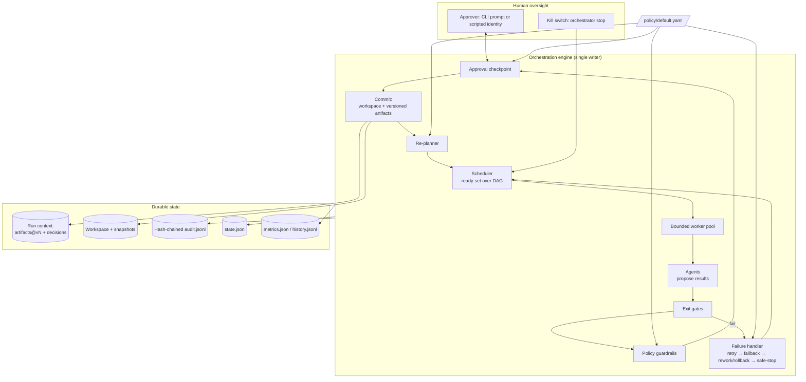
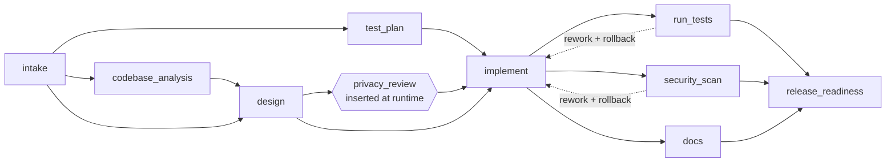

# Architecture

## 1. System overview

The design rests on four principles.

1. **Agents propose, the engine commits.** Agents run in worker threads with read access to the workspace and their declared input artifacts. They return an `AgentResult` containing artifacts, file changes, decisions, plan-change requests and impact flags. Only the engine's main thread applies file changes or records artifacts, and it does so only after the exit gates, the policy check and (where required) human approval. The result is a single writer with no races, and an agent that misbehaves cannot change state on its own.
2. **Governance is data.** Autonomy scopes, approval triggers, security rules, compliance rules, budgets and the list of nodes that may be added at runtime all live in `policy/default.yaml`.
3. **Everything is traceable.** Every artifact version records the exact upstream versions it came from. Every decision, whether made by an agent, a human or the orchestrator, is logged with actor and rationale. Every transition is written to a hash-chained audit log.
4. **Stop safely and stay resumable.** Any unrecoverable condition ends in a *safe-stop*: nothing further is dispatched, in-flight results are discarded, and state is persisted so the run can be resumed.

## 2. The SDLC dependency graph

| Node | Agent | Entry gates | Exit gates | Failure policy |
|---|---|---|---|---|
| intake | requirements_analyst | inputs_available | spec_complete | retry ×2 → fallback → stop |
| codebase_analysis *(brownfield)* | codebase_analyst | workspace_has_code | impact_identified | retry → stop |
| test_plan | test_planner | inputs_available | test_plan_covers_acs | retry → stop |
| design | architect | inputs_available | tasks_acyclic, traceability | retry ×3 → fallback → stop |
| privacy_review *(dynamic)* | privacy_officer | inputs_available | privacy_compliant | stop |
| implement | implementer | inputs_available | has_changes, compiles | retry ×2 → fallback → stop |
| run_tests | test_runner | workspace_has_code | tests_pass, coverage_min, planned_tests_pass | **rework:implement** |
| security_scan | security_scanner | — | no_blocking_findings | **rework:implement** |
| docs | tech_writer | inputs_available | docs_cover_routes | retry → stop |
| release_readiness | release_manager | inputs_available | checklist_green | stop; human **reject → rollback to baseline** |

- **Parallel paths:** `codebase_analysis ∥ test_plan` and `run_tests ∥ security_scan ∥ docs` run at the same time in a bounded pool (`--max-parallel`, default 4).
- **Synchronization:** a node with several dependencies acts as a join. `implement` waits for design and the test plan (and the privacy review, when it has been added). `release_readiness` waits for all three verification branches.
- **Non-linear control flow:** failure edges (`rework:`), revisions sent back to an upstream node, and nodes invalidated when an upstream hash changes all move execution backwards through the graph. The underlying graph stays acyclic, so the schedule is always well-defined.

## 3. Control flow of one node

1. **Ready:** every dependency has SUCCEEDED and any backoff has elapsed.
2. **Entry gates:** preconditions are checked, such as input artifacts existing and the workspace containing code. A failure here BLOCKS the node and safe-stops the run.
3. **Dispatch:** the node gets its primary agent, or its fallback agent after retries are exhausted. The agent receives inputs, feedback from earlier failures or reviewers, and its execution counter.
4. **Exit gates:** the proposed result is validated, for example: tests pass, coverage meets the floor, every acceptance criterion traces to a task, the task graph is acyclic, and planned tests exist and pass.
5. **Policy:** file changes are checked against the agent's write scope, the change-size limit, the delete ban, secret patterns, forbidden calls, SQL built by interpolation, and PII column names.
   - A *critical* finding means nothing is committed and the run safe-stops.
   - A *high* finding counts as a failed attempt and the agent retries with feedback.
6. **Approval:** triggered by the policy's `always` list, by impact flags (schema, public API, dependency, PII), by changes to protected paths, or by assumptions nobody has confirmed. The human can:
   - approve: the result is committed;
   - reject: safe-stop, or a rollback to baseline if the node is the release gate;
   - revise: feedback and answers go to a target node, which re-runs.
7. **Commit:** the workspace is snapshotted as `pre-<node>` and file changes are applied. Artifacts are versioned with their hash and `derived_from` lineage, decisions are recorded, and any open incident for the node is closed (this feeds MTTR).
8. **Re-plan:**
   - If an artifact's hash changed compared with its previous version, the consumers that already completed, and everything downstream of them, are invalidated and re-run.
   - If the agent asked for a new node and policy allowlists that node, it is inserted. Any completed nodes downstream of it are invalidated.
   - If the hash is unchanged, nothing downstream re-runs, so no work is wasted.

**Failure handling:** each node has bounded retries with exponential backoff. After that comes one fallback attempt, which uses a deterministic agent when a live LLM was in use. After that the node's `on_failure` policy applies:

- `rework:<upstream>` restores the upstream node's pre-commit snapshot (a rollback) and re-runs it with the failure details as feedback. The number of rework cycles is capped by `max_rework_cycles`.
- `stop` performs a safe-stop.

**Budgets and kill switch:** the run safe-stops before the next dispatch when any of these trips: `max_total_attempts`, `max_wall_seconds`, or the kill switch (`runs/<id>/STOP`, written by `orchestrator stop`). Every running node gets an *epoch*, so results from invalidated or stopped work are recognized as stale and discarded.

## 4. State, lineage, audit, metrics

- **RunContext.** Artifacts are stored as a list of versions (`requirements_spec@v2`), each with a content hash, the node that produced it, the attempt, and `derived_from` references. `lineage(name)` rebuilds the provenance tree. Decisions (`D001…`) carry a kind, actor, rationale and references. Kinds include assumption, design_choice, approval, replan, rollback, fallback and safe_stop.
- **Persistence.** `state.json` is written atomically (temp file, then rename) after every commit. It holds statuses, attempt counts, the context, graph mutations and metrics. `resume` rebuilds the graph by replaying the recorded mutations.
- **Audit.** `audit.jsonl` is append-only. Each record contains `prev_hash`, and its own `hash` is the SHA-256 of its content. `verify-audit` detects modified, deleted or reordered records. The log captures every status change, gate result, policy finding, approval (with approver, round, comment, answers and wait time), commit (files, artifact version and hash), rollback, fallback, re-plan and safe-stop.
- **Metrics.** Per run: attempts, attempt success rate, retries and retry rate, fallbacks, rollbacks, reworks, re-plans, approvals requested and rejected, policy violations, incidents recovered and unrecovered, **MTTR** (an incident opens at a node's first failure and closes when that node next succeeds, including across a resume), end-to-end latency, and latency per stage. `history.jsonl` and `orchestrator metrics` aggregate across runs.

## 5. Agents and their autonomy boundaries

| Agent | Real computation (every mode) | Reasoning backend used for | Writes |
|---|---|---|---|
| requirements_analyst | ambiguity lexicon; PII signal regexes from policy; merges human clarifications; forces every detected ambiguous term to become a question | structured spec: functional/NFR, ACs, questions with defaults | none (can request allowlisted plan changes) |
| codebase_analyst | Python AST: modules, symbols, routes, SQL tables, import graph; TF-IDF relevance; reverse-dependency blast radius; data flow; risk | — | none |
| architect | task graph to execution waves; flags files the design touches that analysis did not predict; impact flags from the design | approach, contracts, tasks, alternatives, risks, rollback plan | none |
| test_planner | AC → test cases (level, intent) | — | none |
| privacy_officer | checks the design's data handling against compliance policy | — | none |
| implementer | applies anchored edits (each must match exactly once); derives impact flags | edit operations | `shortener/*.py`, `tests/*.py`, `pytest.ini`, `requirements.txt` |
| test_runner | runs pytest with JUnit and coverage in the workspace | — | none |
| security_scanner | secrets, forbidden calls, shell/SQL injection, PII columns, dependency changes, required security tests | — | none |
| tech_writer | loads the real OpenAPI contract, renders API.md, changelog, ADRs | — | `docs/*.md`, `CHANGELOG.md` |
| release_manager | checklist, AC→task→test traceability, migration safety check on the diff, risk register | — | none |

**Reasoning backends.**

- `OfflineProvider` (the default) replays recorded responses from `scenarios/playbooks/*.yaml`.
  - Items tagged `when: {Q2: …}` are included only when the clarified answer matches, which is how a human's revision changes the spec, design, tests and code.
  - Variants such as `implement__buggy` are expressed as deltas of the recorded response and are used for fault injection.
- `AnthropicProvider` calls the Messages API, asks for JSON in the shape of the recorded example, and checks the required keys. Its output goes through the same gates. When it fails, the node retries and then falls back to the offline agent.

## 6. Key design decisions

| Decision | Why | Trade-off |
|---|---|---|
| Explicit DAG + failure edges instead of cyclic graphs | Scheduling stays well-defined and checkable (no cycles, rework targets must be upstream), while rework and revise still provide the backward loops | Loops are declared per node, not arbitrary |
| Agents propose, engine commits (single writer) | Governance cannot be bypassed; no concurrent writes; results are never half-applied | The engine is a serialization point; fine at SDLC time scales |
| Invalidation by content hash | Re-plans only when an upstream output *actually* changed; unchanged re-runs cost nothing downstream | Hashing requires deterministic serialization (sorted JSON) |
| Policy as YAML | Autonomy can be tightened or loosened without code changes, which suits change-advisory review | Policy mistakes are possible; the demo drills exercise it |
| Full-copy snapshots | Simple, exact rollback | O(repo size) per commit; use git worktrees or overlay filesystems at scale |
| Recorded responses as the default backend | Deterministic, reviewable, CI-friendly demos with no secrets | Offline mode does not show model creativity; the live path is available |
| Human approval driven by impact, not by every step | Oversight where risk exists (schema, API, dependencies, PII, release); low-risk steps flow through | Needs trustworthy impact detection; the implementer re-derives impact flags from file paths as a second check |

## 7. The service under change (URL shortener)

`api` (routing, API-key auth, token-bucket rate limit, error mapping, `X-Request-ID`, JSON logs) → `service` (business rules, injectable clock) → `repository` (all SQL, parameterized) → `db` (SQLite, WAL, versioned forward-only migrations).

Key choices:

- **Redirect code:** 307 rather than 301, so every click reaches the service.
- **Short codes:** random base62 codes of length 7 with bounded collision retry, so codes cannot be enumerated.
- **Aliases:** reserved aliases are rejected case-insensitively.
- **Destination validation:**
  - only `http` and `https` are allowed;
  - URLs with embedded credentials are rejected;
  - private, loopback, link-local and metadata IPs are rejected, as are `localhost` and links back to the shortener itself.
- **Deletes are soft:** links are deactivated, not removed.
