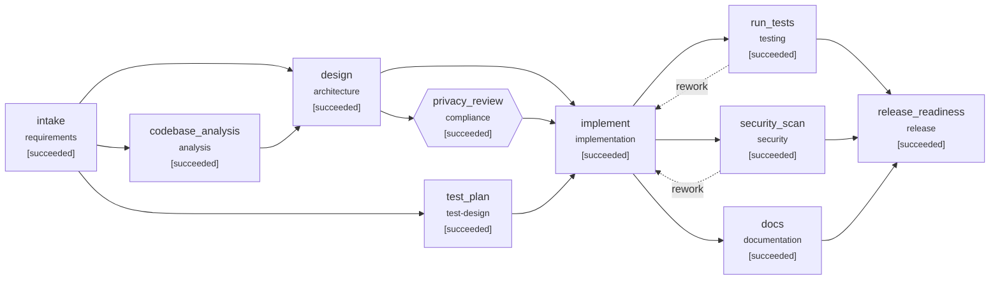

# Engineering summary: Ambiguous: 'make links safer and show who is clicking'

- Run: `demo-ambiguous`  |  scenario: `ambiguous` (ambiguous)
- Outcome: **SUCCEEDED**
- Release recommendation: **GO**

## 1. Requirement understanding

> Our short links need to be safer, and marketing wants to see who is clicking them.
> Please get this done quickly without slowing redirects down.

**Normalized problem:** Reduce abuse of the shortener as a vector for harmful destinations, and give marketing audience analytics - without identifying individuals and without adding latency to redirects.

**Functional requirements**

- Reject creation of links whose destination domain (or a parent domain) is on an operator-managed denylist
- Links whose destination becomes denylisted after creation stop redirecting (410)
- Stats report unique visitors in addition to total clicks
- Visitor identity is pseudonymous: keyed, daily-rotating hash; the raw IP address is never stored
- Visitor hashes are purged after the retention window

**Non-functional requirements**

- Redirect path: no new network calls; one in-process HMAC; no extra queries
- Privacy: data minimisation, purpose limitation (aggregate analytics), retention <= policy maximum

**Acceptance criteria**

| id | criterion |
|---|---|
| AC1 | Creating a link to a denylisted domain or any of its subdomains returns 422 |
| AC2 | An existing link to a newly denylisted domain returns 410 and records no click |
| AC3 | Stats include unique_visitors (distinct visitors per day) |
| AC4 | The raw client IP never reaches storage |
| AC5 | Visitor hash is keyed (secret) and rotates daily |
| AC6 | Visitor hashes older than the retention window are purged; click counts remain |
| AC7 | Existing behaviour is unchanged for links and clients (regression) |

**Ambiguities -> resolution**

| id | term | question | resolution | status |
|---|---|---|---|---|
| Q1 | safer | What threat does 'safer' address? | block harmful destinations via an operator-managed domain denylist | assumed |
| Q2 | safer-scope | Does the denylist apply only to new links, or also stop existing links? | create_and_redirect | confirmed |
| Q3 | who | Does 'see who is clicking' mean identifying individuals? | no: aggregate unique-visitor counts from a pseudonymous daily hash; no personal profiles | assumed |
| Q4 | quickly | Is 'quickly' a delivery deadline or a latency requirement? | latency (read together with 'without slowing redirects'); no deadline was given | assumed |
| Q5 | slowing | What latency budget must redirects keep? | no new I/O on the redirect path; one HMAC (~microseconds); p95 unchanged | assumed |
| Q6 | retention | How long may visitor hashes be kept? | 90 days (policy maximum) | assumed |

Personal-data signals detected: `['\\bwho\\b[^.]*\\bclick']` - privacy review inserted into the plan.

**Out of scope:** Third-party threat-intel feeds (Safe Browsing etc.); Per-person click history; Geo-location

## 2. Codebase reasoning (impact analysis)

Scanned 16 modules; data flow: `shortener.api -> shortener.service -> shortener.repository -> shortener.db`; risk **high** (schema and public API both impacted).

| module | reason | matched terms |
|---|---|---|
| shortener.api | direct | analytic, domain, key, redirect, total, shortener, stat, click |
| shortener.db | direct | add, never, unique, key, click, link |
| shortener.service | direct | unique, redirect, stat, click, link |
| shortener.models | direct | domain, total, stat, click, link |
| shortener.schemas | direct | destination, total, stat, click, link |
| shortener.__init__ | direct | analytic, redirect, shortener, click, link |
| shortener.validation | direct | addres, redirect, shortener, link |
| shortener.main | imports ['shortener.api'] |  |
| shortener.repository | imports ['shortener.db', 'shortener.models'] |  |
| tests.conftest | imports ['shortener.api', 'shortener.db', 'shortener.service'] |  |
| tests.test_api | imports ['shortener.api'] |  |
| tests.test_units | imports ['shortener.db', 'shortener.validation'] |  |

Routes: `GET /healthz`, `GET /readyz`, `POST /api/v1/links`, `GET /api/v1/links/{code}`, `GET /api/v1/links/{code}/stats`, `DELETE /api/v1/links/{code}`, `GET /{code}`

Tables: `links`(id, code, target_url, created_at, expires_at, is_active); `clicks`(id, link_id, clicked_at, referrer, user_agent)

## 3. Design and task decomposition

Denylist is configuration (SHORTENER_BLOCKED_DOMAINS) checked in URL validation with parent-domain matching. Unique visitors are counted from a keyed HMAC of day|ip|user-agent stored in a new nullable clicks.visitor_hash column (migration v2); the raw IP exists only in memory for the request. A retention job nulls hashes older than the window while keeping click counts.

**API changes:** GET /api/v1/links/{code}/stats: + unique_visitors; POST /api/v1/links: 422 for denylisted destinations; GET /{code}: 410 when the destination is denylisted

**Schema changes:** clicks.visitor_hash (add nullable TEXT (migration v2))

| task | title | deps | satisfies | files |
|---|---|---|---|---|
| T1 | Config: denylist, visitor secret, retention | - |  | shortener/config.py |
| T2 | Denylist check with parent-domain matching (creation) | T1 | AC1 | shortener/validation.py |
| T2b | Enforce denylist on redirect for existing links | T2 | AC2 | shortener/service.py |
| T3 | Migration v2: clicks.visitor_hash; repository write/aggregate/purge | - | AC3, AC6 | shortener/db.py, shortener/models.py, shortener/repository.py |
| T4 | Service: keyed daily visitor hash, retention purge | T1, T3 | AC4, AC5, AC6 | shortener/service.py |
| T5 | API: pass client IP to service, expose unique_visitors | T4 | AC3, AC7 | shortener/api.py, shortener/schemas.py |
| T6 | Tests from ACs | T1 | AC1, AC3, AC4, AC5, AC6, AC7 | tests/test_safety_analytics.py |

Files in the design that impact analysis did not predict (review focus): `shortener/config.py`

Execution waves (parallelizable): [T1, T3] -> [T2, T4, T6] -> [T2b, T5]

**Key decisions**

- **Meaning of 'who is clicking'** -> Aggregate unique visitors from a pseudonymous daily hash. Answers the marketing question (reach) without processing identities; keeps the change inside privacy policy.
- **Visitor hash construction** -> HMAC-SHA256 with a server secret, day in the input. Unkeyed hashes of IPv4 are trivially brute-forced; the day component prevents cross-day tracking.
- **Denylist source** -> Operator-managed config list with parent-domain matching. No new network dependency on the redirect path; deterministic; feeds can populate it later.

## 4. Orchestration trace



| seq | node | event | detail |
|---|---|---|---|
| 3 | intake | running | agent=requirements_analyst attempt=1 |
| 5 | intake | waiting_approval | high-impact change: pii; requirement contains ambiguities resolved only by assumptions |
| 6 | intake | **approval_decision** | {"answers": {}, "comment": "auto-approved under scripted policy", "decision": "approve", "revise_target": null, "round": 1, "wait_s": 0.0} |
| 8 | intake | succeeded | 4 functional reqs, 6 ACs, 6 ambiguities (6 assumed), pii=True |
| 9 | intake | **replan** | {"after": ["design"], "before": ["implement"], "inserted": "privacy_review", "reason": "requirement involves personal data (signals: ['\\\\bwho\\\\b[^.]*\\\\bclick'])", "trigger": "plan_change"} |
| 11 | codebase_analysis | running | agent=codebase_analyst attempt=1 |
| 13 | test_plan | running | agent=test_planner attempt=1 |
| 16 | test_plan | succeeded | 8 planned cases ({'unit': 4, 'integration': 4}) |
| 19 | codebase_analysis | succeeded | 16 modules, 7 routes, 2 tables; 7 directly + 5 indirectly impacted; risk=high |
| 21 | design | running | agent=architect attempt=1 |
| 23 | design | waiting_approval | high-impact change: pii; high-impact change: public_api_change; high-impact change: schema_change |
| 24 | design | **approval_decision** | {"answers": {"Q2": "create_and_redirect"}, "comment": "Security team: denylisted domains must also stop EXISTING links, not only new ones.", "decision": "revise", "revise_target": "intake", "round": 1, "wait_s": 0.0} |
| 25 | design | **replan** | {"target": "intake", "trigger": "approval_revise"} |
| 29 | intake | running | agent=requirements_analyst attempt=1 |
| 31 | intake | waiting_approval | high-impact change: pii; requirement contains ambiguities resolved only by assumptions |
| 32 | intake | **approval_decision** | {"answers": {}, "comment": "auto-approved under scripted policy", "decision": "approve", "revise_target": null, "round": 2, "wait_s": 0.0} |
| 34 | intake | succeeded | 5 functional reqs, 7 ACs, 6 ambiguities (5 assumed), pii=True |
| 35 | intake | **replan** | {"artifact": "requirements_spec", "invalidated": ["codebase_analysis", "test_plan"], "trigger": "artifact_changed"} |
| 39 | codebase_analysis | running | agent=codebase_analyst attempt=1 |
| 41 | test_plan | running | agent=test_planner attempt=1 |
| 44 | test_plan | succeeded | 9 planned cases ({'unit': 4, 'integration': 5}) |
| 47 | codebase_analysis | succeeded | 16 modules, 7 routes, 2 tables; 7 directly + 5 indirectly impacted; risk=high |
| 49 | design | running | agent=architect attempt=1 |
| 51 | design | waiting_approval | high-impact change: pii; high-impact change: public_api_change; high-impact change: schema_change |
| 52 | design | **approval_decision** | {"answers": {}, "comment": "Design approved after scope clarification.", "decision": "approve", "revise_target": null, "round": 2, "wait_s": 0.0} |
| 54 | design | succeeded | 7 tasks in 3 waves; 3 API / 1 schema changes |
| 56 | privacy_review | running | agent=privacy_officer attempt=1 |
| 58 | privacy_review | waiting_approval | high-impact change: pii |
| 59 | privacy_review | **approval_decision** | {"answers": {}, "comment": "auto-approved under scripted policy", "decision": "approve", "revise_target": null, "round": 1, "wait_s": 0.0} |
| 61 | privacy_review | succeeded | 5/5 privacy checks passed |
| 63 | implement | running | agent=implementer attempt=1 |
| 65 | implement | waiting_approval | high-impact change: public_api_change; high-impact change: schema_change; change to protected path: shortener/config.py; change to protected path: shortener/db.py |
| 66 | implement | **approval_decision** | {"answers": {}, "comment": "auto-approved under scripted policy", "decision": "approve", "revise_target": null, "round": 1, "wait_s": 0.0} |
| 69 | implement | succeeded | 9 files (8 source, 1 test): denylist + pseudonymous unique-visitor analytics with retention |
| 71 | docs | running | agent=tech_writer attempt=1 |
| 73 | run_tests | running | agent=test_runner attempt=1 |
| 75 | security_scan | running | agent=security_scanner attempt=1 |
| 78 | security_scan | succeeded | 9 files scanned, 0 findings (max=info) |
| 82 | docs | succeeded | API.md (7 routes), CHANGELOG, 3 ADRs |
| 85 | run_tests | succeeded | 62/62 passed, coverage=99.36% |
| 87 | release_readiness | running | agent=release_manager attempt=1 |
| 89 | release_readiness | waiting_approval | 'release_readiness' always requires human sign-off |
| 90 | release_readiness | **approval_decision** | {"answers": {}, "comment": "auto-approved under scripted policy", "decision": "approve", "revise_target": null, "round": 1, "wait_s": 0.0} |
| 92 | release_readiness | succeeded | GO: 8/8 checks green |

**Gates (last evaluation per node)**

| node | gate | result | detail |
|---|---|---|---|
| intake | entry:inputs_available | pass | all inputs present |
| intake | exit:spec_complete | pass | 7 acceptance criteria |
| codebase_analysis | entry:inputs_available | pass | all inputs present |
| codebase_analysis | entry:workspace_has_code | pass | 16 python files |
| codebase_analysis | exit:impact_identified | pass | 12 impacted modules |
| test_plan | entry:inputs_available | pass | all inputs present |
| test_plan | exit:test_plan_covers_acs | pass | every AC has tests |
| design | entry:inputs_available | pass | all inputs present |
| design | exit:tasks_acyclic | pass | 7 tasks, acyclic |
| design | exit:traceability | pass | all ACs traced to tasks |
| privacy_review | entry:inputs_available | pass | all inputs present |
| privacy_review | exit:privacy_compliant | pass | all privacy checks pass |
| implement | entry:inputs_available | pass | all inputs present |
| implement | exit:has_changes | pass | 9 files changed |
| implement | exit:compiles | pass | all python files compile |
| docs | entry:inputs_available | pass | all inputs present |
| docs | exit:docs_cover_routes | pass | 7 routes documented |
| run_tests | entry:inputs_available | pass | all inputs present |
| run_tests | entry:workspace_has_code | pass | 17 python files |
| run_tests | exit:tests_pass | pass | 62/62 passed, 0 failed, 0 errors |
| run_tests | exit:coverage_min | pass | 99.4% (min 85.0%) |
| run_tests | exit:planned_tests_pass | pass | 9 planned tests passed |
| security_scan | entry:inputs_available | pass | all inputs present |
| security_scan | exit:no_blocking_findings | pass | 0 blocking of 0 findings |
| release_readiness | entry:inputs_available | pass | all inputs present |
| release_readiness | exit:checklist_green | pass | 8 checks green |

## 5. Decisions and lineage

| id | node | kind | actor | summary |
|---|---|---|---|---|
| D001 | intake | approval | product-owner@example.com | approve: high-impact change: pii, requirement contains ambiguities resolved only by assumptions |
| D002 | intake | assumption | requirements_analyst | Q1: assumed 'block harmful destinations via an operator-managed domain denylist' |
| D003 | intake | assumption | requirements_analyst | Q2: assumed 'creation_only' |
| D004 | intake | assumption | requirements_analyst | Q3: assumed 'no: aggregate unique-visitor counts from a pseudonymous daily hash; no personal profiles' |
| D005 | intake | assumption | requirements_analyst | Q4: assumed 'latency (read together with 'without slowing redirects'); no deadline was given' |
| D006 | intake | assumption | requirements_analyst | Q5: assumed 'no new I/O on the redirect path; one HMAC (~microseconds); p95 unchanged' |
| D007 | intake | assumption | requirements_analyst | Q6: assumed '90 days (policy maximum)' |
| D008 | intake | replan | orchestrator | inserted 'privacy_review' between ['design'] and ['implement'] |
| D009 | design | approval | product-owner@example.com | revise: high-impact change: pii, high-impact change: public_api_change, high-impact change: schema_change |
| D010 | design | assumption | product-owner@example.com | human clarified ['Q2'] |
| D011 | intake | approval | product-owner@example.com | approve: high-impact change: pii, requirement contains ambiguities resolved only by assumptions |
| D012 | intake | assumption | requirements_analyst | Q1: assumed 'block harmful destinations via an operator-managed domain denylist' |
| D013 | intake | assumption | requirements_analyst | Q3: assumed 'no: aggregate unique-visitor counts from a pseudonymous daily hash; no personal profiles' |
| D014 | intake | assumption | requirements_analyst | Q4: assumed 'latency (read together with 'without slowing redirects'); no deadline was given' |
| D015 | intake | assumption | requirements_analyst | Q5: assumed 'no new I/O on the redirect path; one HMAC (~microseconds); p95 unchanged' |
| D016 | intake | assumption | requirements_analyst | Q6: assumed '90 days (policy maximum)' |
| D017 | intake | replan | orchestrator | 'requirements_spec' changed; invalidating ['codebase_analysis', 'test_plan'] |
| D018 | design | approval | product-owner@example.com | approve: high-impact change: pii, high-impact change: public_api_change, high-impact change: schema_change |
| D019 | design | design_choice | architect | Meaning of 'who is clicking': Aggregate unique visitors from a pseudonymous daily hash |
| D020 | design | design_choice | architect | Visitor hash construction: HMAC-SHA256 with a server secret, day in the input |
| D021 | design | design_choice | architect | Denylist source: Operator-managed config list with parent-domain matching |
| D022 | privacy_review | approval | product-owner@example.com | approve: high-impact change: pii |
| D023 | implement | approval | product-owner@example.com | approve: high-impact change: public_api_change, high-impact change: schema_change, change to protected path: shortener/config.py, change to protected path: shortener/db.py |
| D024 | release_readiness | approval | product-owner@example.com | approve: 'release_readiness' always requires human sign-off |

**Artifact versions**

| artifact | version | hash | producer | derived from |
|---|---|---|---|---|
| requirements_spec | 1 | 4db48afd70c78e85 | intake | - |
| requirements_spec | 2 | 6c28ecb333358296 | intake | clarifications@v1 |
| test_plan | 1 | 910f7d1ec022fa80 | test_plan | requirements_spec@v1 |
| test_plan | 2 | 888d5a64f617ffe7 | test_plan | requirements_spec@v2 |
| impact_analysis | 1 | 8dfa1fe03d130553 | codebase_analysis | requirements_spec@v1 |
| impact_analysis | 2 | 623cee22c848750c | codebase_analysis | requirements_spec@v2 |
| clarifications | 1 | 43eaaea2c3183f42 | human:product-owner@example.com | - |
| design | 1 | dc16e0dcd2961c96 | design | requirements_spec@v2, impact_analysis@v2 |
| privacy_review | 1 | 7da0af8b586d0166 | privacy_review | requirements_spec@v2, design@v1 |
| change_set | 1 | 6913a41010a4880a | implement | requirements_spec@v2, design@v1, test_plan@v2 |
| security_report | 1 | 193a73b6a7f3d6c9 | security_scan | - |
| docs_report | 1 | ee1cc67f4f79b455 | docs | requirements_spec@v2, design@v1 |
| test_report | 1 | 30f8bbc9767087ef | run_tests | test_plan@v2 |
| release_readiness | 1 | 3a3ff163b552f222 | release_readiness | requirements_spec@v2, design@v1, test_plan@v2, test_report@v1, security_report@v1, docs_report@v1, privacy_review@v1 |

## 6. Validation

Tests: **62/62 passed**, coverage **99.36%** (`pytest -q -p no:cacheprovider --junitxml=<run_dir>/test-output/exec1-attempt1/junit.xml --cov=shortener --cov-report=json:<run_dir>/test-output/exec1-attempt1/coverage.json tests`)

**Traceability: acceptance criterion -> tasks -> tests -> result**

| AC | tasks | tests | verified |
|---|---|---|---|
| AC1 | T2, T6 | tests/test_safety_analytics.py::test_http_denylisted_destination_rejected<br>tests/test_safety_analytics.py::test_denylist_matches_parent_domains_only | yes |
| AC2 | T2b | tests/test_safety_analytics.py::test_http_existing_link_blocked_after_denylisting | yes |
| AC3 | T3, T5, T6 | tests/test_safety_analytics.py::test_http_unique_visitors_in_stats | yes |
| AC4 | T4, T6 | tests/test_safety_analytics.py::test_raw_ip_never_persisted | yes |
| AC5 | T4, T6 | tests/test_safety_analytics.py::test_visitor_hash_is_keyed_and_rotates_daily | yes |
| AC6 | T3, T4, T6 | tests/test_safety_analytics.py::test_visitor_hashes_purged_after_retention | yes |
| AC7 | T5, T6 | tests/test_api.py::test_redirect_is_307_and_counts_click<br>tests/test_api.py::test_invalid_url_rejected | yes |

Security scan: 9 files, 0 findings (max severity info).

**Privacy review**

| check | passed | detail |
|---|---|---|
| no raw personal identifiers persisted | True | storage=pseudonymised, pii-named columns=[] |
| identifiers pseudonymised with a keyed hash | True | HMAC-SHA256(server secret, day\|ip\|user-agent), truncated to 128 bits |
| retention <= 90 days | True | 90 days |
| purpose limitation documented | True | aggregate unique-visitor counts for marketing; no individual profiles or exports |
| cross-day linkage prevented | True | day is part of the hash input, so visitors cannot be linked across days |

**Release checklist**

| item | passed | evidence |
|---|---|---|
| full test suite green | True | 62/62 |
| coverage >= 85.0% | True | 99.36% |
| every acceptance criterion verified by a passing test | True | 7/7 ACs |
| no blocking security findings | True | 0 findings, max=info |
| migrations forward-only and additive | True | no destructive statements |
| API reference covers all routes | True | 7 routes |
| rollback plan defined | True | Redeploy the previous version. Migration v2 only adds a nullable column, so old code runs unchanged; optionally run UPDA |
| privacy review passed | True | privacy_review |

## 7. Risks and trade-offs

| risk | likelihood | impact | mitigation | source |
|---|---|---|---|---|
| Denylist is only as good as its curation | high | medium | follow-up: scheduled sync from a threat-intel feed | design |
| Random default secret makes unique counts restart-dependent | medium | low | SHORTENER_VISITOR_SECRET documented as required in production | design |
| Unique visitors undercount users behind shared NAT | medium | low | user agent is part of the hash; documented as an estimate | design |
| assumption Q1 unconfirmed: block harmful destinations via an operator-managed domain denylist | medium | medium | confirm with product owner before GA | requirements |
| assumption Q3 unconfirmed: no: aggregate unique-visitor counts from a pseudonymous daily hash; no personal profiles | medium | medium | confirm with product owner before GA | requirements |
| assumption Q4 unconfirmed: latency (read together with 'without slowing redirects'); no deadline was given | medium | medium | confirm with product owner before GA | requirements |
| assumption Q5 unconfirmed: no new I/O on the redirect path; one HMAC (~microseconds); p95 unchanged | medium | medium | confirm with product owner before GA | requirements |
| assumption Q6 unconfirmed: 90 days (policy maximum) | medium | medium | confirm with product owner before GA | requirements |

**Rollback plan:** Redeploy the previous version. Migration v2 only adds a nullable column, so old code runs unchanged; optionally run UPDATE clicks SET visitor_hash = NULL to drop pseudonymous data.

## 8. Reliability metrics

```json
{
  "end_to_end_latency_s": 2.472,
  "attempts": 14,
  "attempt_success_rate": 0.929,
  "retries": 0,
  "retry_rate": 0.0,
  "fallbacks": 0,
  "rollbacks": 0,
  "reworks": 0,
  "replans": 3,
  "approvals_requested": 7,
  "approvals_rejected": 0,
  "policy_violations": 0,
  "incidents_recovered": 0,
  "incidents_unrecovered": 0,
  "mttr_s": null,
  "stage_latency_s": {
    "analysis": 0.058,
    "architecture": 0.001,
    "compliance": 0.001,
    "documentation": 0.405,
    "implementation": 0.003,
    "release": 0.006,
    "requirements": 0.0,
    "security": 0.033,
    "test-design": 0.0,
    "testing": 2.35
  }
}
```

## 9. Artifacts

- Reviewable change: `change.patch` (452 lines, 14 files)
- Workspace with the change applied: `workspace/`
- Hash-chained audit log: `audit.jsonl` (verify with `python -m orchestrator verify-audit <run_id>`)
- Resumable state: `state.json`; metrics: `metrics.json`; graph: `graph.mmd`; test output: `test-output/`
