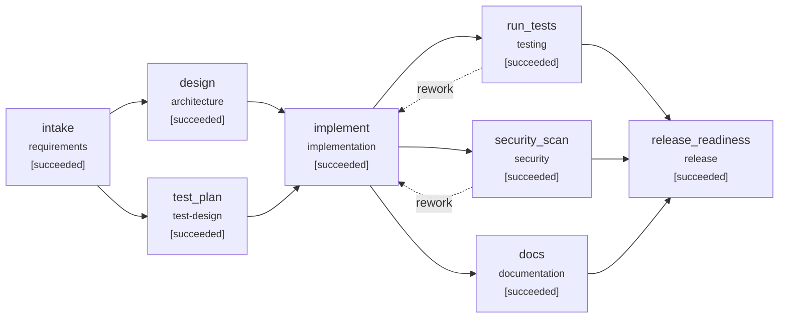

# Engineering summary: Greenfield: build the URL shortener service from scratch

- Run: `demo-greenfield`  |  scenario: `greenfield` (greenfield)
- Outcome: **SUCCEEDED**
- Release recommendation: **GO**

## 1. Requirement understanding

> Build a URL shortener HTTP service. Clients create a short link for an http(s) destination,
> optionally with a custom alias and an expiry time. Visiting the short link redirects to the
> destination and records the click. Link owners can read link metadata and click analytics
> (total clicks, clicks per day, top referrers) and can deactivate links. Write operations can be
> protected by an API key, and link creation is rate limited per client. Unsafe destinations
> (non-http schemes, private network addresses, URLs with embedded credentials, links back to the
> shortener itself) are rejected. Expose health and readiness endpoints for operations.

**Normalized problem:** Provide an HTTP service that maps short, unguessable codes to http(s) destinations, redirects visitors while recording click analytics, and protects itself and its users from abuse.

**Functional requirements**

- Create a short link for an http(s) URL, with optional custom alias and optional expiry
- Redirect GET /{code} to the destination and record a click (timestamp, referrer, user agent)
- Read link metadata and analytics: total clicks, clicks per day, top referrers
- Deactivate (soft-delete) a link
- Optionally require an API key for write operations
- Rate limit link creation per client
- Expose /healthz (liveness) and /readyz (dependency readiness)

**Non-functional requirements**

- Security: reject non-http(s) schemes, private/loopback/link-local targets, embedded credentials, self-links
- Codes are random (non-enumerable) base62; collisions are retried, never overwritten
- Every response carries X-Request-ID for traceability
- Schema changes are versioned, forward-only migrations

**Acceptance criteria**

| id | criterion |
|---|---|
| AC1 | POST /api/v1/links returns 201 with code, short_url, target_url and a Location header |
| AC2 | GET /{code} returns 307 to the destination and records exactly one click |
| AC3 | Stats report total clicks, per-day counts and top referrers |
| AC4 | Custom aliases are unique (409 on conflict) and reserved words are rejected case-insensitively |
| AC5 | Expired links return 410 and are not counted; expiry in the past is rejected |
| AC6 | Unsafe destinations are rejected with 422 |
| AC7 | DELETE deactivates a link; it then returns 404 |
| AC8 | When an API key is configured, writes without a valid key return 401; reads stay public |
| AC9 | Creation beyond the per-client rate returns 429 with Retry-After |
| AC10 | /healthz and /readyz report status |
| AC11 | Random code collisions are retried a bounded number of times, then fail with 503 |

**Ambiguities -> resolution**

| id | term | question | resolution | status |
|---|---|---|---|---|
| Q1 | redirect-status | Should redirects be permanent (301) or temporary (307)? | 307: browsers do not cache it, so every click reaches the service and is counted | assumed |
| Q2 | storage | Which datastore for the first release? | SQLite behind a repository interface; Postgres is a later, local swap | assumed |

**Out of scope:** User accounts / per-owner link listing; Custom domains, QR codes, bulk import

## 3. Design and task decomposition

Layered FastAPI service: HTTP layer (routing, auth, rate limit, error mapping, request IDs) -> framework-free LinkService (business rules, injectable clock) -> LinkRepository (all SQL) -> SQLite with versioned forward-only migrations. Validation and code generation are pure modules.

**API changes:** POST /api/v1/links; GET /api/v1/links/{code}; GET /api/v1/links/{code}/stats; DELETE /api/v1/links/{code}; GET /{code} (redirect); GET /healthz, GET /readyz

**Schema changes:** links. (create (migration v1)); clicks. (create (migration v1) + index (link_id, clicked_at))

| task | title | deps | satisfies | files |
|---|---|---|---|---|
| T1 | Config, domain errors, models | - |  | shortener/__init__.py, shortener/config.py, shortener/errors.py, shortener/models.py |
| T2 | Persistence: migrations + repository | T1 | AC3, AC7 | shortener/db.py, shortener/repository.py |
| T3 | Code generation + URL validation | T1 | AC4, AC6, AC11 | shortener/codes.py, shortener/validation.py |
| T4 | Token-bucket rate limiter | - | AC9 | shortener/ratelimit.py |
| T5 | LinkService business rules | T2, T3 | AC1, AC2, AC5, AC11 | shortener/service.py |
| T6 | HTTP API, schemas, ASGI entrypoint | T4, T5 | AC1, AC2, AC3, AC7, AC8, AC9, AC10 | shortener/api.py, shortener/schemas.py, shortener/main.py, requirements.txt |
| T7 | Unit + integration test suites | T6 | AC1, AC2, AC3, AC4, AC5, AC6, AC7, AC8, AC9, AC10, AC11 | tests/conftest.py, tests/test_api.py, tests/test_units.py, pytest.ini |

Execution waves (parallelizable): [T1, T4] -> [T2, T3] -> [T5] -> [T6] -> [T7]

**Key decisions**

- **Redirect status code** -> 307 Temporary Redirect with Cache-Control max-age=0. 301 is cached by browsers, so repeat clicks bypass the service and analytics undercount; 307 also preserves the method.
- **Short code generation** -> Cryptographically random base62, length 7, bounded retry on collision. Non-enumerable (codes cannot be walked), no coordination between replicas, 62^7 ~ 3.5e12 space.
- **Storage** -> SQLite with versioned forward-only migrations behind a repository. Zero-ops for v1; the repository boundary keeps a Postgres migration local to one module.
- **Click recording** -> Synchronous insert on the redirect path. Simplest correct option; sub-millisecond at v1 scale; no loss-on-crash semantics to explain.

## 4. Orchestration trace



| seq | node | event | detail |
|---|---|---|---|
| 3 | intake | running | agent=requirements_analyst attempt=1 |
| 5 | intake | waiting_approval | requirement contains ambiguities resolved only by assumptions |
| 6 | intake | **approval_decision** | {"answers": {}, "comment": "auto-approved under scripted policy", "decision": "approve", "revise_target": null, "round": 1, "wait_s": 0.0} |
| 8 | intake | succeeded | 7 functional reqs, 11 ACs, 2 ambiguities (2 assumed), pii=False |
| 10 | design | running | agent=architect attempt=1 |
| 12 | test_plan | running | agent=test_planner attempt=1 |
| 13 | design | **attempt_failed** | {"attempt": 1, "error": "LLMError: injected fault: provider error for 'design' (execution 1)"} |
| 17 | test_plan | succeeded | 16 planned cases ({'unit': 4, 'integration': 12}) |
| 19 | design | running | agent=architect attempt=2 |
| 21 | design | waiting_approval | high-impact change: public_api_change; high-impact change: schema_change |
| 22 | design | **approval_decision** | {"answers": {}, "comment": "auto-approved under scripted policy", "decision": "approve", "revise_target": null, "round": 1, "wait_s": 0.0} |
| 24 | design | succeeded | 7 tasks in 5 waves; 6 API / 2 schema changes |
| 26 | implement | running | agent=implementer attempt=1 |
| 28 | implement | waiting_approval | high-impact change: dependency_change; high-impact change: public_api_change; high-impact change: schema_change; change to protected path: shortener/config.py; change to protected path: shortener/db.py |
| 29 | implement | **approval_decision** | {"answers": {}, "comment": "auto-approved under scripted policy", "decision": "approve", "revise_target": null, "round": 1, "wait_s": 0.0} |
| 32 | implement | succeeded | 18 files (15 source, 3 test): Scaffold the v1 service and its test suites per tasks T1-T7 |
| 34 | docs | running | agent=tech_writer attempt=1 |
| 36 | run_tests | running | agent=test_runner attempt=1 |
| 38 | security_scan | running | agent=security_scanner attempt=1 |
| 41 | security_scan | succeeded | 18 files scanned, 1 findings (max=medium) |
| 45 | docs | succeeded | API.md (7 routes), CHANGELOG, 4 ADRs |
| 48 | run_tests | succeeded | 53/53 passed, coverage=98.64% |
| 50 | release_readiness | running | agent=release_manager attempt=1 |
| 52 | release_readiness | waiting_approval | 'release_readiness' always requires human sign-off |
| 53 | release_readiness | **approval_decision** | {"answers": {}, "comment": "auto-approved under scripted policy", "decision": "approve", "revise_target": null, "round": 1, "wait_s": 0.0} |
| 55 | release_readiness | succeeded | GO: 7/7 checks green |

**Gates (last evaluation per node)**

| node | gate | result | detail |
|---|---|---|---|
| intake | entry:inputs_available | pass | all inputs present |
| intake | exit:spec_complete | pass | 11 acceptance criteria |
| design | entry:inputs_available | pass | all inputs present |
| design | exit:tasks_acyclic | pass | 7 tasks, acyclic |
| design | exit:traceability | pass | all ACs traced to tasks |
| test_plan | entry:inputs_available | pass | all inputs present |
| test_plan | exit:test_plan_covers_acs | pass | every AC has tests |
| implement | entry:inputs_available | pass | all inputs present |
| implement | exit:has_changes | pass | 18 files changed |
| implement | exit:compiles | pass | all python files compile |
| docs | entry:inputs_available | pass | all inputs present |
| docs | exit:docs_cover_routes | pass | 7 routes documented |
| run_tests | entry:inputs_available | pass | all inputs present |
| run_tests | entry:workspace_has_code | pass | 16 python files |
| run_tests | exit:tests_pass | pass | 53/53 passed, 0 failed, 0 errors |
| run_tests | exit:coverage_min | pass | 98.6% (min 85.0%) |
| run_tests | exit:planned_tests_pass | pass | 16 planned tests passed |
| security_scan | entry:inputs_available | pass | all inputs present |
| security_scan | exit:no_blocking_findings | pass | 0 blocking of 1 findings |
| release_readiness | entry:inputs_available | pass | all inputs present |
| release_readiness | exit:checklist_green | pass | 7 checks green |

## 5. Decisions and lineage

| id | node | kind | actor | summary |
|---|---|---|---|---|
| D001 | intake | approval | tech-lead@example.com | approve: requirement contains ambiguities resolved only by assumptions |
| D002 | intake | assumption | requirements_analyst | Q1: assumed '307: browsers do not cache it, so every click reaches the service and is counted' |
| D003 | intake | assumption | requirements_analyst | Q2: assumed 'SQLite behind a repository interface; Postgres is a later, local swap' |
| D004 | design | approval | tech-lead@example.com | approve: high-impact change: public_api_change, high-impact change: schema_change |
| D005 | design | design_choice | architect | Redirect status code: 307 Temporary Redirect with Cache-Control max-age=0 |
| D006 | design | design_choice | architect | Short code generation: Cryptographically random base62, length 7, bounded retry on collision |
| D007 | design | design_choice | architect | Storage: SQLite with versioned forward-only migrations behind a repository |
| D008 | design | design_choice | architect | Click recording: Synchronous insert on the redirect path |
| D009 | implement | approval | tech-lead@example.com | approve: high-impact change: dependency_change, high-impact change: public_api_change, high-impact change: schema_change, change to protected path: shortener/config.py, change to protected path: shortener/db.py |
| D010 | release_readiness | approval | tech-lead@example.com | approve: 'release_readiness' always requires human sign-off |

**Artifact versions**

| artifact | version | hash | producer | derived from |
|---|---|---|---|---|
| requirements_spec | 1 | be7eba063668ef57 | intake | - |
| test_plan | 1 | 35ed793cc3ce3a23 | test_plan | requirements_spec@v1 |
| design | 1 | 73d90af00ebbf7f3 | design | requirements_spec@v1 |
| change_set | 1 | 4e27d5bafe3dd5af | implement | requirements_spec@v1, design@v1, test_plan@v1 |
| security_report | 1 | e1cdb4e1a5a6812a | security_scan | - |
| docs_report | 1 | 8ebbfeec3c52152e | docs | requirements_spec@v1, design@v1 |
| test_report | 1 | ad3c152d583a078b | run_tests | test_plan@v1 |
| release_readiness | 1 | 5f36f5cc3ba912b4 | release_readiness | requirements_spec@v1, design@v1, test_plan@v1, test_report@v1, security_report@v1, docs_report@v1 |

## 6. Validation

Tests: **53/53 passed**, coverage **98.64%** (`pytest -q -p no:cacheprovider --junitxml=<run_dir>/test-output/exec1-attempt1/junit.xml --cov=shortener --cov-report=json:<run_dir>/test-output/exec1-attempt1/coverage.json tests`)

**Traceability: acceptance criterion -> tasks -> tests -> result**

| AC | tasks | tests | verified |
|---|---|---|---|
| AC1 | T5, T6, T7 | tests/test_api.py::test_create_link_returns_201_with_short_url | yes |
| AC2 | T5, T6, T7 | tests/test_api.py::test_redirect_is_307_and_counts_click | yes |
| AC3 | T2, T6, T7 | tests/test_api.py::test_stats_aggregate_by_day_and_referrer | yes |
| AC4 | T3, T7 | tests/test_api.py::test_custom_alias_and_conflict<br>tests/test_api.py::test_reserved_alias_rejected_case_insensitively | yes |
| AC5 | T5, T7 | tests/test_api.py::test_expired_link_returns_410_and_does_not_count<br>tests/test_api.py::test_expiry_in_past_rejected | yes |
| AC6 | T3, T7 | tests/test_api.py::test_invalid_url_rejected<br>tests/test_units.py::test_rejected_urls | yes |
| AC7 | T2, T6, T7 | tests/test_api.py::test_delete_deactivates_link | yes |
| AC8 | T6, T7 | tests/test_api.py::test_api_key_enforced_on_writes_when_configured | yes |
| AC9 | T4, T6, T7 | tests/test_api.py::test_rate_limit_returns_429_with_retry_after<br>tests/test_units.py::test_token_bucket_refills_over_time | yes |
| AC10 | T6, T7 | tests/test_api.py::test_health_and_readiness | yes |
| AC11 | T3, T5, T7 | tests/test_units.py::test_collision_retries_then_succeeds<br>tests/test_units.py::test_collision_exhaustion_raises | yes |

Security scan: 18 files, 1 findings (max severity medium).

| rule | severity | path | detail |
|---|---|---|---|
| dependency-change | medium | requirements.txt: | dependency manifest changed: supply-chain review |

**Release checklist**

| item | passed | evidence |
|---|---|---|
| full test suite green | True | 53/53 |
| coverage >= 85.0% | True | 98.64% |
| every acceptance criterion verified by a passing test | True | 11/11 ACs |
| no blocking security findings | True | 1 findings, max=medium |
| migrations forward-only and additive | True | no destructive statements |
| API reference covers all routes | True | 7 routes |
| rollback plan defined | True | New service behind its own hostname: rollback = stop routing traffic / redeploy the previous image. Schema v1 has no pre |

## 7. Risks and trade-offs

| risk | likelihood | impact | mitigation | source |
|---|---|---|---|---|
| Shortener abused for phishing/malware redirects | medium | high | scheme/credential/private-host validation; denylist is a follow-up | design |
| SSRF-style redirects into internal networks | low | high | private, loopback, link-local and metadata IPs rejected | design |
| Code enumeration | low | medium | random codes; no sequential ids | design |
| SQLite single-writer contention under load | medium | medium | WAL mode; repository boundary for Postgres swap | design |
| Rate limit is per instance | high | low | documented; move buckets to Redis when scaled out | design |
| assumption Q1 unconfirmed: 307: browsers do not cache it, so every click reaches the service and is counted | medium | medium | confirm with product owner before GA | requirements |
| assumption Q2 unconfirmed: SQLite behind a repository interface; Postgres is a later, local swap | medium | medium | confirm with product owner before GA | requirements |
| dependency-change in requirements.txt | low | medium | reviewed; below blocking threshold | security |

**Rollback plan:** New service behind its own hostname: rollback = stop routing traffic / redeploy the previous image. Schema v1 has no predecessor, so no data rollback is needed.

## 8. Reliability metrics

```json
{
  "end_to_end_latency_s": 2.098,
  "attempts": 9,
  "attempt_success_rate": 0.889,
  "retries": 1,
  "retry_rate": 0.111,
  "fallbacks": 0,
  "rollbacks": 0,
  "reworks": 0,
  "replans": 0,
  "approvals_requested": 4,
  "approvals_rejected": 0,
  "policy_violations": 0,
  "incidents_recovered": 1,
  "incidents_unrecovered": 0,
  "mttr_s": 0.205,
  "stage_latency_s": {
    "architecture": 0.002,
    "documentation": 0.422,
    "implementation": 0.004,
    "release": 0.005,
    "requirements": 0.0,
    "security": 0.039,
    "test-design": 0.0,
    "testing": 1.838
  }
}
```

## 9. Artifacts

- Reviewable change: `change.patch` (1396 lines, 24 files)
- Workspace with the change applied: `workspace/`
- Hash-chained audit log: `audit.jsonl` (verify with `python -m orchestrator verify-audit <run_id>`)
- Resumable state: `state.json`; metrics: `metrics.json`; graph: `graph.mmd`; test output: `test-output/`
