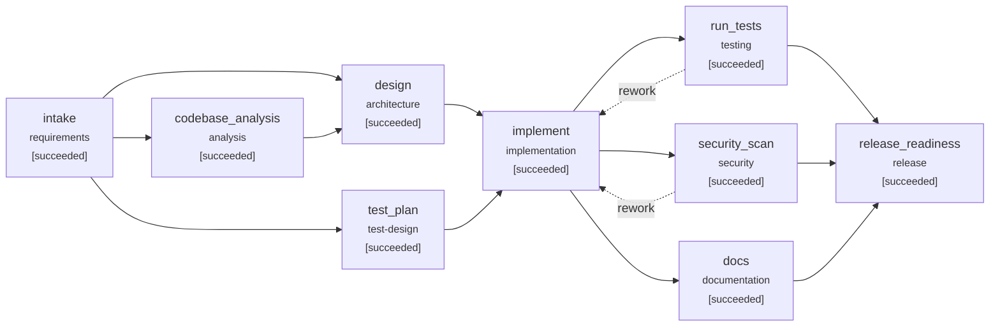

# Engineering summary: Brownfield: add limited-use links (max_clicks) to the existing service

- Run: `live-brownfield`  |  scenario: `brownfield` (brownfield)
- Outcome: **SUCCEEDED**
- Release recommendation: **GO**
- Release sign-off: **sowmya** (human)
- Approvals: 4 human, 0 simulated
- Reasoning backend: `anthropic` (live model); content origins in this run: computed, generated
- Sandbox for generated code: process (network: not isolated on this OS; filesystem: not isolated (use docker backend))

## 1. Requirement understanding

> Marketing wants limited-use links for promotions, for example a code that is valid only for the
> first 100 visits. Add an optional maximum number of clicks when creating a link. Once the limit
> is reached, the short link must stop redirecting and respond 410 Gone. Link metadata must show the
> limit and the remaining clicks. Existing links, and clients that do not send the new field, must
> keep working unchanged.

**Normalized problem:** Support limited-use short links for marketing promotions: when creating a link, a client may optionally supply a maximum number of clicks. Once that many successful redirects have been served, the short link stops redirecting and responds 410 Gone. Link metadata exposes the limit and the remaining clicks. Existing links and clients that do not send the new field must behave exactly as before.

**Functional requirements**

- Accept an optional integer field max_clicks when creating a link; the valid range is 1..1,000,000 inclusive
- If max_clicks is omitted or null, the link is unlimited and behaves exactly as before
- Each successful redirect (existing 307 behaviour) counts as one click against the limit
- Once a link has served max_clicks redirects, GET /{code} returns 410 Gone, does not redirect, and does not record a click
- Link metadata (create response and link/stats retrieval) exposes max_clicks and remaining_clicks
- remaining_clicks = max_clicks - recorded clicks, never below 0; both fields are null for unlimited links
- A max_clicks value that is outside 1..1,000,000, non-integer (string, float, boolean) or zero or negative is rejected with 422 and no link is created
- Existing links are treated as unlimited after the schema upgrade
- Unknown short codes keep returning their existing response (404), distinct from 410 for exhausted links

**Non-functional requirements**

- The limit must hold under concurrent redirects: exactly max_clicks redirects succeed, with no overshoot
- The schema change must be additive and backward compatible (nullable column, no data rewrite, old code can still run on the new schema)
- The migration must be versioned and idempotent, and upgrade an existing v1 database in place
- No extra network calls on the redirect path; the limit check and click recording happen in a single datastore operation
- The API change is additive only: existing request and response fields keep their names, types and semantics

**Acceptance criteria**

| id | criterion |
|---|---|
| AC1 | Creating a link with max_clicks returns it with max_clicks and remaining_clicks; remaining decreases by one per successful redirect |
| AC2 | After max_clicks redirects the link returns 410 and further attempts are not counted as clicks |
| AC3 | max_clicks outside 1..1,000,000 or non-integer is rejected with 422 |
| AC4 | Links created without max_clicks are unlimited (max_clicks and remaining_clicks null) and existing behaviour is unchanged (regression) |
| AC5 | Under 20 concurrent redirects a max_clicks=5 link records exactly 5 clicks |
| AC6 | An existing v1 database migrates to v2 and existing links stay unlimited; running migrations repeatedly is safe |

**Ambiguities -> resolution**

| id | term | question | resolution | status |
|---|---|---|---|---|
| Q1 | limit-accounting | Do rejected (over-limit) visits count in analytics? | no: only successful redirects are recorded as clicks | assumed |
| Q2 | mutability | Can max_clicks be changed after creation? | no: immutable in this change (out of scope) | assumed |
| Q3 | concurrency | Is small overshoot under concurrent load acceptable? | no: the limit is enforced atomically | assumed |
| Q4 | limit-range | What are the allowed bounds for max_clicks? | integer 1..1,000,000 inclusive; 0, negatives and non-integers return 422 | assumed |
| Q5 | response-format | What should the 410 response body look like and how are unknown codes distinguished? | standard JSON error body with status 410; unknown codes keep returning 404 | assumed |
| Q6 | metadata-shape | How are the limit and remaining clicks represented for unlimited links? | both fields present with null value | assumed |
| Q7 | existing-links | Should existing links be given a limit during migration? | no: existing links remain unlimited (max_clicks null) | assumed |
| Q8 | click-definition | What counts as a click against the limit? | each successful redirect response; HEAD or prefetch requests are treated the same as GET if the current code already records them, with no new filtering | assumed |

**Out of scope:** Changing max_clicks after creation (no PATCH/update endpoint); Custom landing page or body customisation for exhausted links beyond a standard 410 response; Time-based expiry of links; Counting or reporting rejected (over-limit) visits as a separate metric; Per-visitor or per-IP limits and bot filtering; Resetting or extending the click counter

## 2. Codebase reasoning (impact analysis)

Scanned 16 modules; data flow: `shortener.api -> shortener.service -> shortener.repository -> shortener.db`; risk **high** (schema and public API both impacted).

| module | reason | matched terms |
|---|---|---|
| shortener.db | direct | integer, migration, never, null, schema, one, record, creat |
| shortener.api | direct | client, unknown, response, count, limit, redirect, creat, stat |
| shortener.service | direct | exhaust, gone, range, cod, record, redirect, stat, create |
| shortener.schemas | direct | optional, response, short, count, field, creat, stat, create |
| shortener.repository | direct | count, limit, record, creat, stat, create, value, click |
| shortener.ratelimit | direct | float, return, upgrade, limit, value, str |
| shortener.validation | direct | against, non, reject, redirect, value, link, str |
| shortener.main | imports ['shortener.api'] |  |
| tests.conftest | imports ['shortener.api', 'shortener.db', 'shortener.repository', 'shortener.service'] |  |
| tests.test_api | imports ['shortener.api'] |  |
| tests.test_units | imports ['shortener.db', 'shortener.ratelimit', 'shortener.validation'] |  |

Routes: `GET /healthz`, `GET /readyz`, `POST /api/v1/links`, `GET /api/v1/links/{code}`, `GET /api/v1/links/{code}/stats`, `DELETE /api/v1/links/{code}`, `GET /{code}`

Tables: `links`(id, code, target_url, created_at, expires_at, is_active); `clicks`(id, link_id, clicked_at, referrer, user_agent)

## 3. Design and task decomposition

Add a nullable links.max_clicks column in migration v2. SQLite's ALTER TABLE ADD COLUMN is metadata-only, so there is no data rewrite and existing rows read as NULL, meaning unlimited. Enforce the limit in the repository with a single conditional INSERT ... SELECT into clicks. It inserts the click row only when the link is unlimited or the current click count is below max_clicks, and the caller checks rowcount (1 = recorded, 0 = exhausted). Check and record happen in one statement, so there is no overshoot under concurrency and no extra round trip on the redirect path. The service first resolves the code (unknown stays 404, as today), then calls the conditional record. If nothing was recorded it raises an exhausted-link error that the API maps to 410 with the standard JSON error body. Over-limit visits record nothing (Q1). Validation of max_clicks is strict (an int and not a bool, 1..1,000,000), applied both in the service/validation layer (so direct service callers get a validation error) and in the request schema (422 over HTTP). remaining_clicks is derived on read as max(0, max_clicks - COUNT(clicks)), with no second source of truth. Both new response fields are always present and null for unlimited links (Q6). The API change is additive only.

**API changes:** POST /api/v1/links: new optional request field max_clicks (strict integer, 1..1,000,000, null or omitted = unlimited); bool, float, string, 0, negative or >1,000,000 return 422 and create no link; POST /api/v1/links response, GET /api/v1/links/{code} and GET /api/v1/links/{code}/stats: add max_clicks and remaining_clicks (both nullable, always present; remaining_clicks never below 0); GET /{code}: returns 410 Gone with the standard JSON error body once max_clicks successful redirects have been recorded; no redirect and no click recorded. Unknown codes still return 404 and normal links still return 307; No changes to existing field names, types or semantics; no new endpoints; no update/PATCH of max_clicks (out of scope)

**Schema changes:** links.max_clicks (add nullable INTEGER with no default (migration v2, guarded by a PRAGMA table_info check and a schema version record so it is idempotent; existing rows stay NULL = unlimited)); clicks.(link_id) (no column change; ensure an index covering link_id (CREATE INDEX IF NOT EXISTS, in migration v2) so the per-link COUNT in the conditional insert and in remaining_clicks stays cheap)

| task | title | deps | satisfies | files |
|---|---|---|---|---|
| T1 | Migration v2: nullable links.max_clicks, plus an IF NOT EXISTS clicks(link_id) index; idempotent and versioned; upgrades a v1 DB in place | - | AC6 | shortener/db.py, tests/test_units.py |
| T2 | Model and repository: persist max_clicks on link insert, return it on reads, add atomic record_click_if_allowed (conditional INSERT ... SELECT, rowcount result) and a click-count read for remaining_clicks | T1 | AC5, AC2 | shortener/models.py, shortener/repository.py |
| T3 | Validation and service: strict max_clicks validation (reject bool, float, str, out of range), create with limit, redirect uses the atomic record and raises an exhausted-link error (410) distinct from not-found, compute remaining_clicks in link/stats views | T2 | AC2, AC3, AC4 | shortener/validation.py, shortener/errors.py, shortener/service.py |
| T4 | API contract: optional strict max_clicks on the create request; max_clicks and remaining_clicks on link and stats responses; map the exhausted error to a 410 JSON body | T3 | AC1, AC2, AC3, AC4 | shortener/schemas.py, shortener/api.py |
| T5 | Tests from the ACs (test-first, parallel with T2-T4): HTTP create/remaining, 410 and no extra clicks, 422 matrix, unlimited regression, 20-thread atomicity at max_clicks=5, v1-to-v2 migration with existing links; keep the existing test_api regression tests green | T1 | AC1, AC2, AC3, AC4, AC5, AC6 | tests/test_max_clicks.py, tests/conftest.py |

Files in the design that impact analysis did not predict (review focus): `shortener/errors.py, shortener/models.py`

Execution waves (parallelizable): [T1] -> [T2, T5] -> [T3] -> [T4]

**Key decisions**

- **Limit enforcement** -> Single conditional INSERT ... SELECT ... WHERE max_clicks IS NULL OR (SELECT COUNT(*) FROM clicks WHERE link_id = ?) < max_clicks, checking rowcount. A check-then-act sequence in application code races under concurrent redirects. One SQL statement is atomic under SQLite's single-writer lock (with a busy timeout for contending writers), needs no extra round trip, and does the limit check and click recording in one datastore operation as required.
- **Response when exhausted** -> 410 Gone with the standard JSON error body; unknown codes stay 404. Matches the spec and lets clients and marketing tooling distinguish an exhausted link from one that never existed.
- **remaining_clicks source** -> Derived on read as max(0, max_clicks - COUNT(clicks for link)). The clicks table stays the single source of truth, so there is nothing to keep consistent and no backfill.
- **Request validation location** -> Strict integer validation at both the schema layer (422) and the service/validation layer. The service tests call the service directly, and bool is a subclass of int in Python, so it must be rejected explicitly in addition to relying on schema strictness.

## 4. Orchestration trace



| seq | node | event | detail |
|---|---|---|---|
| 3 | intake | running | agent=requirements_analyst attempt=1 |
| 6 | intake | waiting_approval | requirement contains ambiguities resolved only by assumptions |
| 7 | intake | **approval_decision** | {"answers": {}, "comment": "No", "decision": "approve", "human": true, "mode": "interactive", "request_hash": "685648a0f80a9d04", "revise_target": null, "round": 1, "wait_s": 15.208} |
| 9 | intake | succeeded | 9 functional reqs, 6 ACs, 8 ambiguities (8 assumed), pii=False |
| 11 | codebase_analysis | running | agent=codebase_analyst attempt=1 |
| 13 | test_plan | running | agent=test_planner attempt=1 |
| 16 | test_plan | succeeded | 10 planned cases ({'unit': 4, 'integration': 6}) |
| 19 | codebase_analysis | succeeded | 16 modules, 7 routes, 2 tables; 7 directly + 4 indirectly impacted; risk=high |
| 21 | design | running | agent=architect attempt=1 |
| 24 | design | waiting_approval | high-impact change: public_api_change; high-impact change: schema_change |
| 25 | design | **approval_decision** | {"answers": {}, "comment": "", "decision": "approve", "human": true, "mode": "interactive", "request_hash": "139124bb41609ebb", "revise_target": null, "round": 1, "wait_s": 7.527} |
| 27 | design | succeeded | 5 tasks in 4 waves; 4 API / 2 schema changes |
| 29 | implement | running | agent=implementer attempt=1 |
| 32 | implement | waiting_approval | high-impact change: public_api_change; high-impact change: schema_change; change to protected path: shortener/db.py |
| 33 | implement | **approval_decision** | {"answers": {}, "comment": "reviewed file list; relying on test gate.", "decision": "approve", "human": true, "mode": "interactive", "request_hash": "ef0e222f3a849b84", "revise_target": null, "round": 1, "wait_s": 64.483 |
| 36 | implement | succeeded | 9 files (8 source, 1 test): max_clicks: migration v2 (nullable column + clicks(link_id) index), atomic conditional click insert, strict validation, 410 for exhausted links, additive API fields, and te |
| 38 | docs | running | agent=tech_writer attempt=1 |
| 40 | run_tests | running | agent=test_runner attempt=1 |
| 42 | security_scan | running | agent=security_scanner attempt=1 |
| 45 | security_scan | succeeded | 9 files scanned, 0 findings (max=info) |
| 49 | docs | succeeded | API.md (7 routes), CHANGELOG, 4 ADRs |
| 52 | run_tests | succeeded | 85/85 passed, coverage=98.99% |
| 54 | release_readiness | running | agent=release_manager attempt=1 |
| 56 | release_readiness | waiting_approval | 'release_readiness' always requires human sign-off |
| 57 | release_readiness | **approval_decision** | {"answers": {}, "comment": "reviewed file list; relying on test gate.", "decision": "approve", "human": true, "mode": "interactive", "request_hash": "bb5b0e0b54becdc3", "revise_target": null, "round": 1, "wait_s": 22.314 |
| 59 | release_readiness | succeeded | GO: 7/7 checks green |

**Gates (last evaluation per node)**

| node | gate | result | detail |
|---|---|---|---|
| intake | entry:inputs_available | pass | all inputs present |
| intake | exit:spec_complete | pass | 6 acceptance criteria |
| codebase_analysis | entry:inputs_available | pass | all inputs present |
| codebase_analysis | entry:workspace_has_code | pass | 16 python files |
| codebase_analysis | exit:impact_identified | pass | 11 impacted modules |
| test_plan | entry:inputs_available | pass | all inputs present |
| test_plan | exit:test_plan_covers_acs | pass | every AC has tests |
| design | entry:inputs_available | pass | all inputs present |
| design | exit:tasks_acyclic | pass | 5 tasks, acyclic |
| design | exit:traceability | pass | all ACs traced to tasks |
| implement | entry:inputs_available | pass | all inputs present |
| implement | exit:has_changes | pass | 9 files changed |
| implement | exit:compiles | pass | all python files compile |
| docs | entry:inputs_available | pass | all inputs present |
| docs | exit:docs_cover_routes | pass | 7 routes documented |
| run_tests | entry:inputs_available | pass | all inputs present |
| run_tests | entry:workspace_has_code | pass | 17 python files |
| run_tests | exit:tests_pass | pass | 85/85 passed, 0 failed, 0 errors, exit_code=0 |
| run_tests | exit:coverage_min | pass | 99.0% (min 85.0%) |
| run_tests | exit:planned_tests_pass | pass | 10 planned tests passed |
| security_scan | entry:inputs_available | pass | all inputs present |
| security_scan | exit:no_blocking_findings | pass | 0 blocking of 0 findings |
| release_readiness | entry:inputs_available | pass | all inputs present |
| release_readiness | exit:checklist_green | pass | 7 checks green |

## 5. Decisions and lineage

| id | node | kind | actor | summary |
|---|---|---|---|---|
| D001 | intake | approval | sowmya | approve: requirement contains ambiguities resolved only by assumptions |
| D002 | intake | assumption | requirements_analyst | Q1: assumed 'no: only successful redirects are recorded as clicks' |
| D003 | intake | assumption | requirements_analyst | Q2: assumed 'no: immutable in this change (out of scope)' |
| D004 | intake | assumption | requirements_analyst | Q3: assumed 'no: the limit is enforced atomically' |
| D005 | intake | assumption | requirements_analyst | Q4: assumed 'integer 1..1,000,000 inclusive; 0, negatives and non-integers return 422' |
| D006 | intake | assumption | requirements_analyst | Q5: assumed 'standard JSON error body with status 410; unknown codes keep returning 404' |
| D007 | intake | assumption | requirements_analyst | Q6: assumed 'both fields present with null value' |
| D008 | intake | assumption | requirements_analyst | Q7: assumed 'no: existing links remain unlimited (max_clicks null)' |
| D009 | intake | assumption | requirements_analyst | Q8: assumed 'each successful redirect response; HEAD or prefetch requests are treated the same as GET if the current code already records them, with no new filtering' |
| D010 | design | approval | sowmya | approve: high-impact change: public_api_change, high-impact change: schema_change |
| D011 | design | design_choice | architect | Limit enforcement: Single conditional INSERT ... SELECT ... WHERE max_clicks IS NULL OR (SELECT COUNT(*) FROM clicks WHERE link_id = ?) < max_clicks, checking rowcount |
| D012 | design | design_choice | architect | Response when exhausted: 410 Gone with the standard JSON error body; unknown codes stay 404 |
| D013 | design | design_choice | architect | remaining_clicks source: Derived on read as max(0, max_clicks - COUNT(clicks for link)) |
| D014 | design | design_choice | architect | Request validation location: Strict integer validation at both the schema layer (422) and the service/validation layer |
| D015 | implement | approval | sowmya | approve: high-impact change: public_api_change, high-impact change: schema_change, change to protected path: shortener/db.py |
| D016 | release_readiness | approval | sowmya | approve: 'release_readiness' always requires human sign-off |

**Artifact versions and content provenance**

| artifact | version | hash | producer | derived from | content origin | source / model | response sha256 |
|---|---|---|---|---|---|---|---|
| requirements_spec | 1 | a4c69abd8f5617d5 | intake | - | generated | claude-sonnet-5-5 | b045dd440824 |
| test_plan | 1 | fe32372be3920580 | test_plan | requirements_spec@v1 | computed | test_planner | - |
| impact_analysis | 1 | ba247cb18ed4009a | codebase_analysis | requirements_spec@v1 | computed | codebase_analyst | - |
| design | 1 | 3ccee2180f389031 | design | requirements_spec@v1, impact_analysis@v1 | generated | claude-sonnet-5-5 | aa419b3591d3 |
| change_set | 1 | f0ce9ab0836b604b | implement | requirements_spec@v1, design@v1, test_plan@v1 | generated | claude-sonnet-5-5 | d2677ac92e21 |
| security_report | 1 | 0a4752b41ef31171 | security_scan | - | computed | security_scanner | - |
| docs_report | 1 | 6691791567392314 | docs | requirements_spec@v1, design@v1 | computed | tech_writer | - |
| test_report | 1 | 0668f4e3fb6059a2 | run_tests | test_plan@v1 | computed | test_runner | - |
| release_readiness | 1 | 7dafb3c4ab6ac8c4 | release_readiness | requirements_spec@v1, design@v1, test_plan@v1, test_report@v1, security_report@v1, docs_report@v1 | computed | release_manager | - |

## 6. Validation

Tests: **85/85 passed**, coverage **98.99%** (`pytest -q -p no:cacheprovider --junitxml=<run_dir>/test-output/exec1-attempt1/junit.xml --cov=shortener --cov-report=json:<run_dir>/test-output/exec1-attempt1/coverage.json tests`)

**Traceability: acceptance criterion -> tasks -> tests -> result**

| AC | tasks | tests | verified |
|---|---|---|---|
| AC1 | T4, T5 | tests/test_max_clicks.py::test_http_create_with_max_clicks_shows_remaining | yes |
| AC2 | T2, T3, T4, T5 | tests/test_max_clicks.py::test_http_limit_reached_returns_410 | yes |
| AC3 | T3, T4, T5 | tests/test_max_clicks.py::test_http_invalid_max_clicks_rejected<br>tests/test_max_clicks.py::test_service_rejects_out_of_range_max_clicks | yes |
| AC4 | T3, T4, T5 | tests/test_max_clicks.py::test_http_unlimited_links_unchanged<br>tests/test_api.py::test_redirect_is_307_and_counts_click<br>tests/test_api.py::test_stats_aggregate_by_day_and_referrer | yes |
| AC5 | T2, T5 | tests/test_max_clicks.py::test_repository_limit_is_atomic | yes |
| AC6 | T1, T5 | tests/test_max_clicks.py::test_migration_upgrades_existing_v1_database<br>tests/test_units.py::test_migrations_are_idempotent_and_versioned | yes |

Security scan: 9 files, 0 findings (max severity info).

**Release checklist**

| item | passed | evidence |
|---|---|---|
| full test suite green (pytest exit code 0) | True | 85/85, exit_code=0 |
| coverage >= 85.0% | True | 98.99% |
| every acceptance criterion verified by a passing test | True | 6/6 ACs |
| no blocking security findings | True | 0 findings, max=info |
| migrations forward-only and additive | True | no destructive statements |
| API reference covers all routes | True | 7 routes |
| rollback plan defined | True | Redeploy the previous application version. Migration v2 only adds a nullable column and an index, so v1 code runs unchan |

## 7. Risks and trade-offs

| risk | likelihood | impact | mitigation | source |
|---|---|---|---|---|
| Race or overshoot under concurrent redirects | low | high | Conditional single-statement insert with rowcount check; AC5 test runs 20 concurrent redirects against max_clicks=5 and asserts exactly 5 clicks; set a SQLite busy timeout so contending writers wait instead of erroring | design |
| Migration v2 fails or is non-idempotent on an existing v1 database | low | high | Check PRAGMA table_info before ALTER, record the version in the same transaction, use CREATE INDEX IF NOT EXISTS, and test upgrading a populated v1 DB plus repeated runs | design |
| COUNT(*) on hot limited links slows the redirect path | low | medium | Index on clicks(link_id) and a count bounded by max_clicks <= 1,000,000; the check only applies to limited links; move to a counter column if redirect p95 regresses | design |
| Regression for unlimited links or existing redirect/stats behaviour (307, click recording, aggregation) | medium | high | A NULL max_clicks bypasses the count in the conditional insert; existing test_api tests stay in the regression set; no existing fields are changed | design |
| Wrong 404 vs 410 precedence or a click recorded on a rejected visit | low | medium | Resolve the code first (404 if unknown), then the conditional insert; the 410 branch performs no insert, and the AC2 test asserts the click count is unchanged after rejected attempts | design |
| Clients with strict response schemas see two new fields | low | low | Fields are additive and nullable; existing field names and types are untouched | design |
| Old code after a rollback ignores the limit on links created with max_clicks | low | medium | Documented in the rollback plan; notify marketing owners of limited promotions if a rollback happens | design |
| assumption Q1 unconfirmed: no: only successful redirects are recorded as clicks | medium | medium | confirm with product owner before GA | requirements |
| assumption Q2 unconfirmed: no: immutable in this change (out of scope) | medium | medium | confirm with product owner before GA | requirements |
| assumption Q3 unconfirmed: no: the limit is enforced atomically | medium | medium | confirm with product owner before GA | requirements |
| assumption Q4 unconfirmed: integer 1..1,000,000 inclusive; 0, negatives and non-integers return 422 | medium | medium | confirm with product owner before GA | requirements |
| assumption Q5 unconfirmed: standard JSON error body with status 410; unknown codes keep returning 404 | medium | medium | confirm with product owner before GA | requirements |
| assumption Q6 unconfirmed: both fields present with null value | medium | medium | confirm with product owner before GA | requirements |
| assumption Q7 unconfirmed: no: existing links remain unlimited (max_clicks null) | medium | medium | confirm with product owner before GA | requirements |
| assumption Q8 unconfirmed: each successful redirect response; HEAD or prefetch requests are treated the same as GET if the current code already records them, with no new filtering | medium | medium | confirm with product owner before GA | requirements |

**Rollback plan:** Redeploy the previous application version. Migration v2 only adds a nullable column and an index, so v1 code runs unchanged on the v2 schema and no down-migration or data fix is required. While rolled back, links created with max_clicks behave as unlimited (limit ignored), so notify marketing and avoid launching limited promotions until the fix is redeployed. Rolling forward again restores enforcement using the stored max_clicks values, and clicks recorded in the meantime count against the limit. If the migration itself fails, it runs transactionally, so the DB stays at v1 and the deploy can be aborted.

## 8. Reliability metrics

```json
{
  "end_to_end_latency_s": 206.261,
  "active_execution_s": 96.73,
  "approval_wait_s": 109.531,
  "attempts": 9,
  "attempt_success_rate": 1.0,
  "retries": 0,
  "retry_rate": 0.0,
  "fallbacks": 0,
  "rollbacks": 0,
  "reworks": 0,
  "replans": 0,
  "approvals_requested": 4,
  "approvals_rejected": 0,
  "approvals_human": 4,
  "approvals_simulated": 0,
  "policy_violations": 0,
  "incidents_recovered": 0,
  "incidents_unrecovered": 0,
  "mttr_s": null,
  "stage_latency_s": {
    "analysis": 0.034,
    "architecture": 28.263,
    "documentation": 0.525,
    "implementation": 53.072,
    "release": 0.004,
    "requirements": 13.57,
    "security": 0.019,
    "test-design": 0.0,
    "testing": 1.684
  }
}
```

## 9. Artifacts

- Reviewable change: `change.patch` (589 lines, 15 files)
- Workspace with the change applied: `workspace/`
- Hash-chained audit log: `audit.jsonl` (verify with `python -m orchestrator verify-audit <run_id>`)
- Resumable state: `state.json`; metrics: `metrics.json`; graph: `graph.mmd`; test output: `test-output/`
